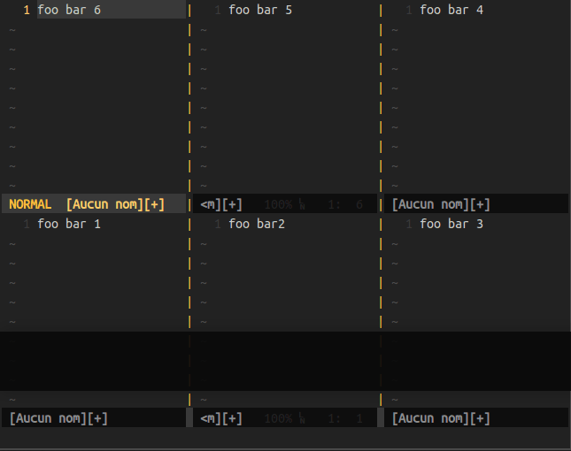

# vZoom - <small>Quickly maximize & unmaximize the current window</small>


## Description

This plugin allows to maximize/unmaximize the current window:

- Manually

	

- Or automatically:

	

## Mappings

No mapping by default, define your own.  
e.g.

```vim
nmap gsz <Plug>(vzoom)
```

Use it to maximize/unmaximize your current window.  
Even quicker, just leave the maximized window and it will get its initial size back.

## Commands

You can enable automatic zoom with:

```vim
:VZoomAutoToggle
```

For disabling it, you can either use the command above or the `<Plug>(vzoom)` key mapping.

## Installation

Copy the distributed files into Vim runtime directory which is usually `~/.vim/`, or `$HOME/vimfiles` on Windows.  
Or in a better way, use a vim plugin manager.

e.g with [Vim-plug](https://github.com/junegunn/vim-plug) plus lazyloading:

```vim
Plug 'KabbAmine/vZoom.vim', {'on': ['<Plug>(vzoom)', 'VZoomAutoToggle']}
```

## Configuration

The plugin's configuration is stored in one global dictionnary `g:vzoom`.

To define/modify an option you can either:

```
let g:vzoom = {}
let g:vzoom.option1 = 'foo'
let g:vzoom.option2 = 0
```

Or:

```vim
let g:vzoom = {
			\ 'option1': 'foo',
			\ 'option2': 0
		\ }
```

### Options

| option                    | description                                            | default             |
| ------------------------- | ---------------------------------------------------    | ------------------- |
| `equalise_windows`        | Equalise size of windows (`<C-w>=`) after unmaximizing | `0`                 |

**N.B**  
- The plugin uses `setwinvar()` function to set back the initial size of the window, but unfortunately sometimes it can fail. So to prevent strange behavior, always set `g:vzoom.equalise_windows` to `1`.
- For the same reason above, when using `VZoomAutoToggle` and disabling auto-zoom the windows are always resized equally regardless of the `g:vzoom.equalise_windows` value.

## Notes

Thanks to Bram Moolenaar for creating the best piece of software in the world :heart:

Thanks to you if you're using vZoom.

## License

MIT
